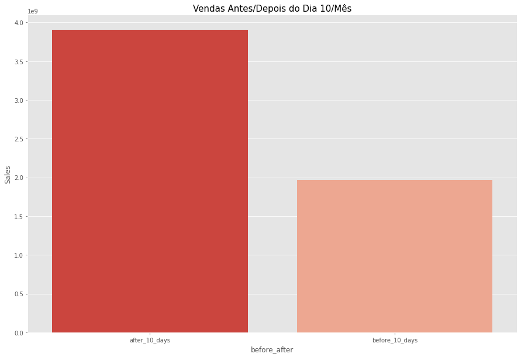
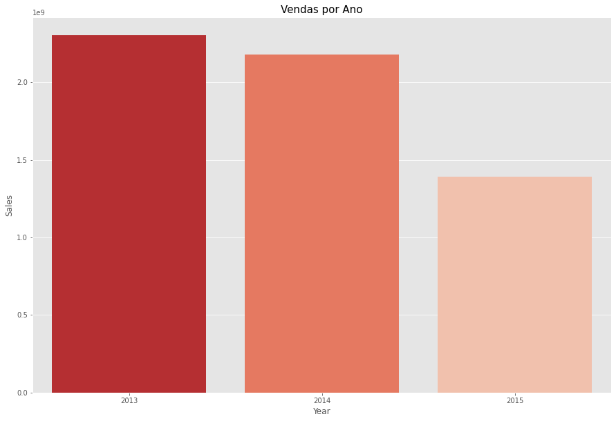
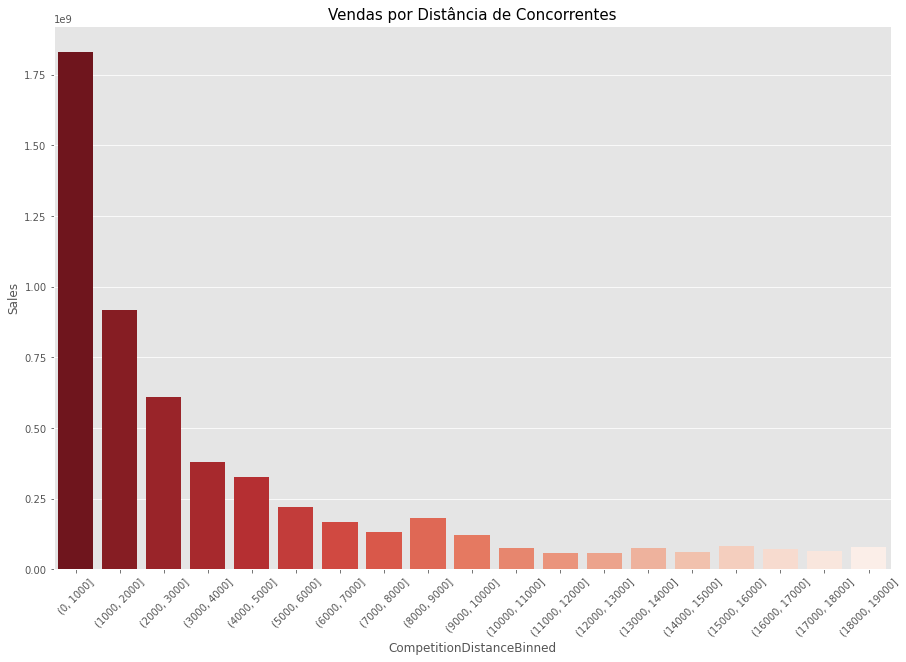
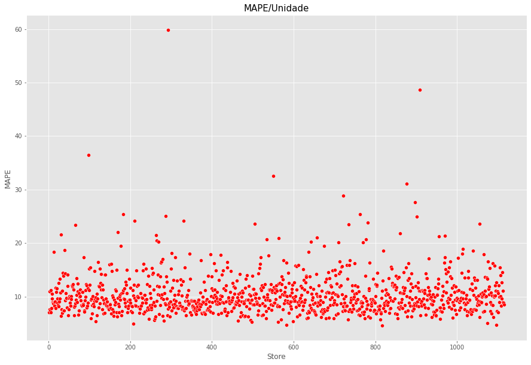

Este é um projeto de regressão.  

O conjunto de dados utilizado está disponível [neste link](https://www.kaggle.com/c/rossmann-store-sales). 

Uma apresentação em PowerPoint abordando as principais etapas do projeto está disponível [neste link](https://show.zohopublic.com/publish/8ulnq1503aa16c77f43a980e358d241332809).

# Entendimento do Negócio

A Rossmann é uma das maiores redes de drogarias da Europa, com cerca de 56 mil funcionários e mais de 4 mil unidades. Com o grande sucesso da marca, a empresa planeja uma reforma geral a fim de renovar e padronizar a estética de todas as suas lojas.

Para essa reforma ser possível a equipe de negócios da Rossmann precisaria contar com as previsões de vendas de todas as unidades para as próximas seis semanas, porém, atualmente a previsão de vendas é feita através de uma planilha Excel, considerando apenas a média das vendas, que em muitos casos, resulta em uma previsão muito distante do valor real. Diante disso, a empresa decidiu contratar um cientista de dados para ficar ciente de qual é a melhor solução para o problema.

Durante a reunião de negócios, o cientista de dados explicou os detalhes de uma previsão de vendas, bem como os metódos que poderiam ser utilizados. Ao final da reunião, ficou a cargo do cientista de dados montar um modelo de previsão de vendas para responder a seguinte questão: **Quanto cada unidade venderá nas próximas seis semanas?**

# Dicionário de Dados

As seguintes suposições foram feitas sobre o problema de negócio:
- Os dados estão em formato estruturado e serão disponibilizados em arquivos "csv".
- Os dias em que as unidades estiveram fechadas serão removidos da análise.
- Apenas unidades com valores de vendas maiores que zero serão consideradas.
- Para as unidades que não possuirem a informação da distância do concorrente mais próximo (CompetitionDistance), iremos considerar um valor bem acima dos observados.

Além disso, também foi disponibilizado o dicionário de dados:

| Variáveis                        | Descrição                                                    |
| -------------------------------- | ------------------------------------------------------------ |
| Store                            | Código de identificação de cada unidade da drogaria          |                          
| DayOfWeek                        | Dia da semana do registro                                    |
| Date                             | Data do registro                                             |
| Sales                            | Total de vendas registrado no dia                            |
| Customers                        | Número de clientes no dia                                    |
| Open                             | Indica se a drogaria estava trabalhando no dia (0 = não, 1 = sim) |
| Promo                            | Indica se a drogaria estava participando da promoção "normal" |
| StateHoliday                     | Indica se a unidade trabalha durante os feriados |
| SchoolHoliday                    | Indica se a data do registro era epóca de férias escolares  |
| Assortment                       | Nível de sortimento de produtos da unidade (a, b, c) |
| CompetitionDistance              | Distância em metros da unidade do concorrente mais próximo |
| CompetitionOpenSince[Month/Year] | Ano e mês em que o concorrente mais próximo foi inaugurado |
| Promo2                           | Indica se a drogaria estava participando da promoção "estendida" (0 = não, 1 = sim) |
| Promo2Since[Week/Year]           | Semana e ano que a drogaria começou a participar da promoção estendida |
| PromoInterval                    | Descreve os intervalos que a promoção estendida é iniciada |

# Estratégia da Solução

Como estratégia para a solução dos problemas apresentados, definimos as seguintes etapas: 
- **1. Entendimento do Negócio:** nesta etapa inicial, o principal objetivo é compreender o problema de negócio e as necessidades do cliente.

- **2. Entendimento dos Dados:** aqui, iremos tratar as principais inconsistências encontradas nos dados, também criaremos hipóteses de negócio e realizaremos uma análise detalhada em cada variável. 

- **3. Engenharia de Atributos:** criaremos novas variáveis a fim de resumir as informações e facilitar o aprendizado dos modelos.

- **4. Pré-Processamento dos Dados:** nosso objetivo é preparar os dados para a aplicação dos modelos preditivos. Técnicas como redimensionamento e seleção das melhores variáveis serão aplicadas nessa etapa.

- **5. Modelagem Preditiva:** criaremos funções para treinar e avaliar o desempenho de três algoritmos de regressão.

- **6. Avaliação dos Modelos**: aqui, iremos comparar o desempenho dos modelos treinados. 

- **7. Conclusões Finais:** por fim, entregaremos o resultado final do projeto.

# TOP 3 Insights 

**H1. As unidades deveriam vender mais depois do dia 10 de cada mês.**  
**Verdadeiro:** as unidades vendem mais após o dia 10 de cada mês.  

**H4. As unidades deveriam vender mais ao longo dos anos.**  
**Falso:** vemos claramente uma queda no número de vendas ao longo dos anos. 

**H9. As unidades com concorrentes mais próximos deveriam vender menos.**  
**Falso:** unidades com concorrentes mais próximos vendem mais.

# Modelagem Preditiva

Os seguintes modelos foram testados:

- Regressão Linear (Ridge);
- Regressão Linear (Lasso);
- Random Forest Regressor.

# Avaliação dos Modelos

De modo a respeitar a ordem cronológica dos dados, foi utilizada a técnica de Time Series Cross-Validation para cada modelo, avaliando o Erro Médio Absoluto (MAE), o Erro Médio Absoluto Porcentagem (MAPE) e o Erro Quadrático Médio Raiz (RMSE).    
A performance real dos modelos é dada pela média dos erros +/- o desvio padrão do erro, representados na tabela abaixo:  

|    Modelo            |     MAE CV      |    MAPE CV    |     RMSE CV       |
|:--------------------:|:---------------:|:-------------:|:-----------------:|
| Random Forest Regressor	    | 853.65 +/- 213.05	  | 11.78 +/- 2.06	| 1278.42 +/- 316.98 |
| Linear Regression	          | 2108.99 +/- 335.01	| 29.82 +/- 1.86	| 3013.54 +/- 519.62 |
| Linear Regression - Lasso	  | 2130.05 +/- 367.59	| 29.56 +/- 1.25  | 3066.85 +/- 548.48 |

O modelo RandomForestRegressor foi o que apresentou o melhor desempenho.

- **MAE**: o modelo apresenta em média um valor de erro de $853.
- **MAPE**: esse erro médio representa 11.7%, ou seja, para cada valor predito do modelo ele pode subestimar ou superestimar o resultado em 11.7%.

 
A tabela abaixo mostra as piores previsões para respectiva unidade atingindo até 59% de margem de erro (MAPE), explicando que algumas unidades são mais desafiadoras de se prever. 

|   Store |   Predictions |   WorstScenario  |   BestScenario  |      MAE |     MAPE |
|--------:|--------------:|-----------------:|----------------:|---------:|---------:|
|292|	107769.069507|	104226.514095|	111311.624919|	3542.555412|	59.849305|
|909|	244436.375370|	237332.628573|	251540.122167|	7103.746797|	48.673154|
|98|	280147.888920|	278142.496518|	282153.281322|	2005.392402|	36.456502|
|550|	253841.112603|	252179.271722|	255502.953484|	1661.840881|	32.525347|
|876|	214881.073593|	210915.360542|	218846.786644|	3965.713051|	31.150108|

No entanto, as lojas  que apresentaram grandes erros no resultado das previsões são minorias, podendo ser identificadas como os pontos discrepantes no gráfico abaixo:

Por fim, a tabela abaixo mostra a soma das previsões de vendas de todas as lojas, bem como os piores e melhores cenários:

| scenario       | values           |
|:---------------|:-----------------|
|Predictions     |	$291,661,573.80 |
|WorstScenario   |	$290,876,668.31 |
|BestScenario    |	$292,446,479.29 |

# Conclusões Finais
Para um primeiro ciclo, o modelo RandomForestRegressor apresentou um resultado dentro da faixa do aceitavel, embora algumas unidades se apresentaram difíceis de terem o comportamento previsto apresentando o MAPE entre 0.30 a 0.60, esse primeiro resultado seria apresentado para a empresa, a fim de informar o andamento do projeto e o que já se tem como solução.

Como próximo passo para o projeto, poderíamos iniciar um segundo ciclo buscando abordagens diferentes, tendo em vista principalmente as unidades com comportamento difíceis de serem previsto.

Possíveis pontos para serem abordados no segundo ciclo:

Trabalhar com os dados NA de maneira diferente;
Rescaling e Encode dos dados com metodologias diferentes;
Trabalhar com novas Features para a previsão.
Otimizar o modelo, realizando a busca pelos melhores hiperparâmetros.

# Autor

Rafael Felippe  

